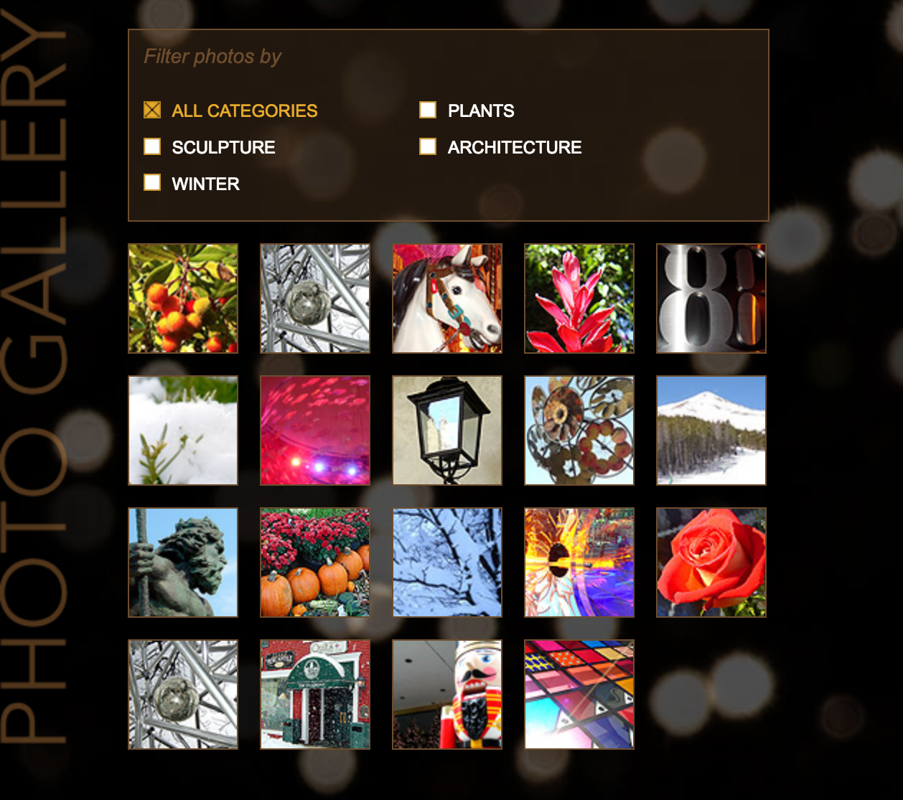

# Lynda - Creating a Responsive Sortable Photo Gallery with jQuery

Give your visitors a smart and dynamic experience when reviewing your photography. This project shows how to create a photo gallery that sorts and rearranges your photos based on keywords you add to the HTML. In addition, display larger photos using lightbox, and even allow your visitors to navigate through the lightbox — giving them an alternate navigation option to review your photos.

Topics include:
- Creating and exporting web graphics
- Setting up the HTML containers
- Styling the layout with CSS
- Tagging your gallery with data
- Adding a dropdown menu
- Preparing your photos and thumbnails
- Adding jQuery to your project
- Adding a lightbox preview for your photos
- Making the layout responsive

[View demo site here.](https://webdevtuts.github.io/sortable_photo_gallery/)

